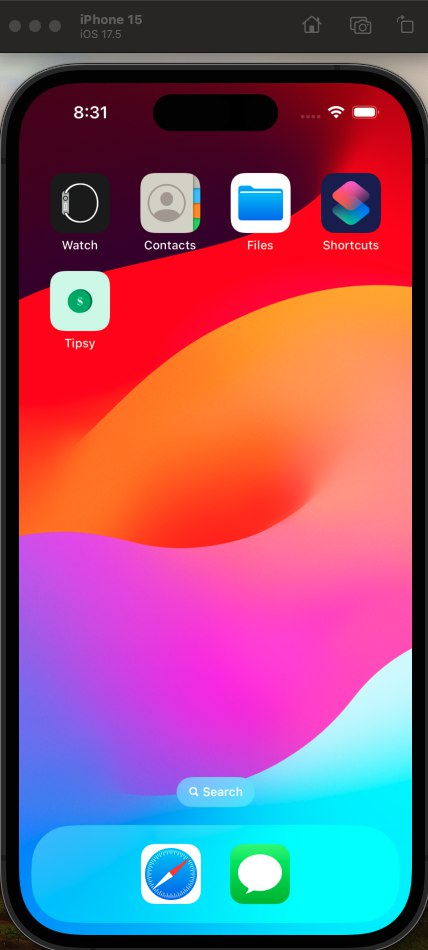
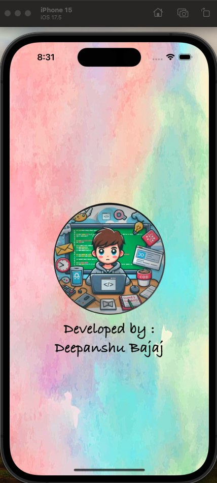
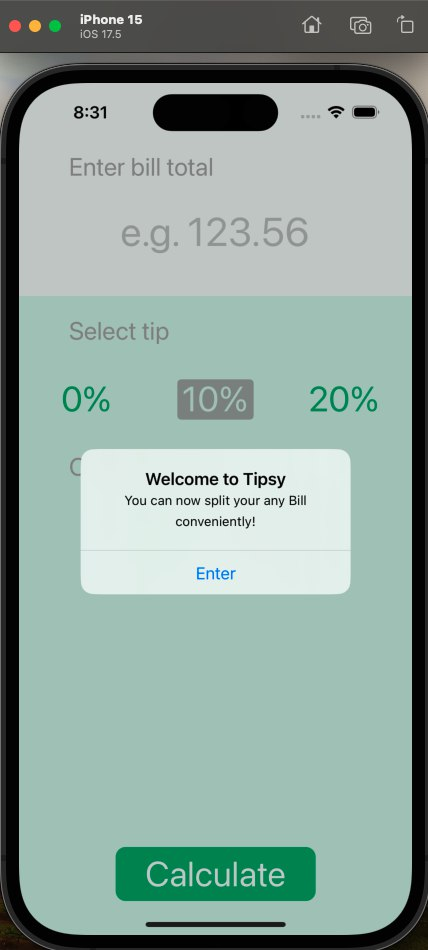
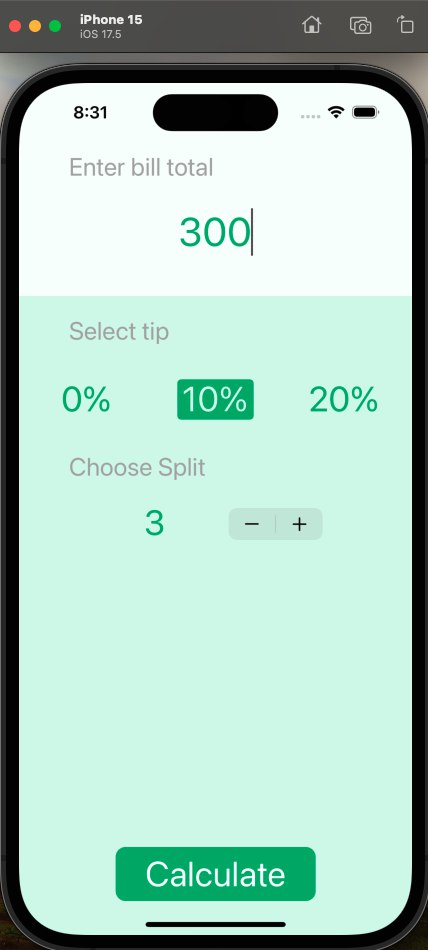
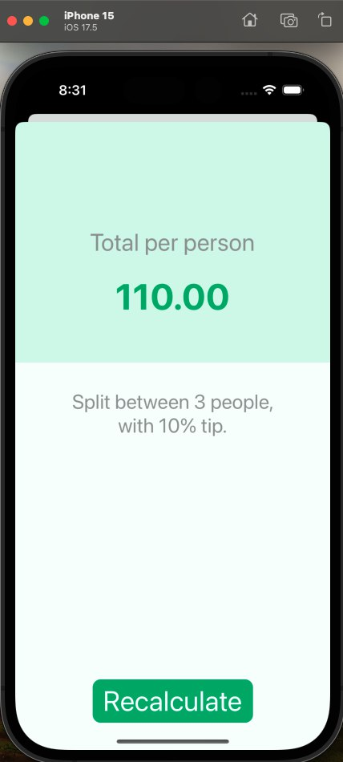

<h1 align="center">Tipsy - iOS App</h1>

**Tipsy** is a simple and efficient app designed to split expenses among friends, family, or any other group. Whether you're sharing a bill at a restaurant, splitting rent, or any other type of group expense, Tipsy makes it easy. You can calculate the split equally or apply a 10% or 20% interest with just a few taps — no need for manual calculations!

## Features:

- **Expense Splitting**: Effortlessly split any expense equally among a group of people.
- **Interest Calculation**: Split the bill with 10% or 20% interest, making it perfect for all kinds of situations.
- **Interactive UI**: A user-friendly interface that makes it easy for anyone to use and manage their expenses.
- **Real-Time Calculation**: See the split amounts updated in real-time as you adjust the number of people or percentage.

## Installation:

To run this project locally:

1. Clone the repository:
    ```bash
    git clone https://github.com/deepanshubajaj/Tipsy-iOSApp.git
    ```

2. Open the project in Xcode:
    ```bash
    open Tipsy.xcodeproj
    ```

3. Build and run the app on a simulator or physical device.

> Make sure you have Xcode installed and configured properly to run the project.

## App Look:

<p align="center">
  
</p>
<p align="center">
  *App snapshot in the simulator.*
</p>

## Screenshots:

<p align="center">
  
</p>
<p align="center">
  *Splash screen displayed upon app launch.*
</p>

<p align="center">
  <div style="display: flex; justify-content: center; gap: 10px;">
    
    
    
  </div>
</p>

<p align="center">
  *Screenshots of the Tipsy app showing different stages of the expense splitting process.*
</p>

## App Icon:

<p align="center">
  
</p>
<p align="center">
  *The app icon reflects the fun and easy-going nature of the Tipsy app.*
</p>

## Video Demo:

Here’s a short video showcasing the app's functionality:

<p align="center">
  
</p>

[Watch Working Video](ProjectOutputs/WorkingVideo/workingVideo.mov)
